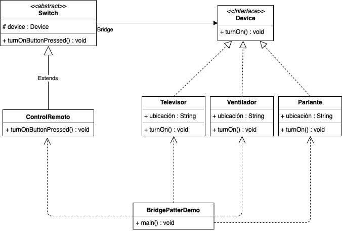

# Bridge
Separa una abstracción de su implementación para que ambos puedan variar independientemente. A diferencia del patrón Adapter, considera como las interfaces son implementadas, en este sentido asocia abstracción y sus potenciales implementaciones.

## Integrantes
- Isabela Muriel
- Juan Jose Parra
- Luisa María Vásquez

## Ejemplo
En una casa hay varios dispositivos, se desea que cada dispositivo sea encendido por un control remoto especifico. Una implementación típica para este problema sería crear una clase abstracta Dispositivo, y cada una de las subclases (cada dispositivo) tendrá una clase ControlRemoto.

Entonces, si por ejemplo se tienen tres dispositivos, un televisor, un ventilador y un parlante, cada uno de estos tendrá una subclase ControlRemoto que lo controle. Esta implementación funciona bien, sin embargo, al momento de extender o modificar el código lo hace muy complicado debido a que todo es altamente acoplado, por lo que, si se quisieran tener n dispositivos, será necesario crear n clases ControlRemoto. Además, con esta solución habrá mucha repetición de código, ya que los controles funcionan igual, lo único que cambia es el dispositivo que controla.

Lo que se busca con el patrón de diseño Bridge es desacoplar la abstracción de la implementación para así poder extender o modificar el código fácilmente.

Volviendo al ejemplo, la manera correcta de aplicar el patrón de diseño es tener una clase Switch como la abstracción y una clase ControlRemoto como la abstracción refinada, asociado con estos se tiene la interfaz Dispositivo y su implementación de clases concretas, es decir cada dispositivo especifico (Televisor, Ventilador, Parlante).

De esta manera es posible que cada dispositivo sea controlado por el control remoto que se desee sin necesidad de crear muchas clases nuevas, simplemente hay que crear una instancia de ControlRemoto y asignarle el dispositivo que este controla.

## Modelo de Clases

## Descripción ejemplo
En la clase BridgePatterDemo(main) se crean 4 dispositivos, un televisor ubicado en la sala, un ventilador ubicado en la habitación principal, un parlante ubicado en el estudio y otro televisor ubicado en la habitación principal. Luego, se crean los respectivos controles especificando a que dispositivo pertenece. Finalmente, se presiona el botón de encendido y se imprime cual fue el dispositivo que se acaba de prender. Si se deseara que un control remoto encendiera un dispositivo diferente, simplemente habría que cambiar la especificación del dispositivo que se le pasa como parametro.

## Referencias
1.  https://programacion.net/articulo/patrones_de_diseno_viii_patrones_estructurales_bridge_1010 
2.  https://www.geeksforgeeks.org/bridge-design-pattern/ 
3.  https://es.wikipedia.org/wiki/Bridge_(patrón_de_diseño) 
4.  https://java2blog.com/bridge-design-pattern-in-java/
5.  http://csharp-video-tutorials.blogspot.com/2018/01/bridge-design-pattern.html
6.  http://migranitodejava.blogspot.com/2011/06/bridge.html
